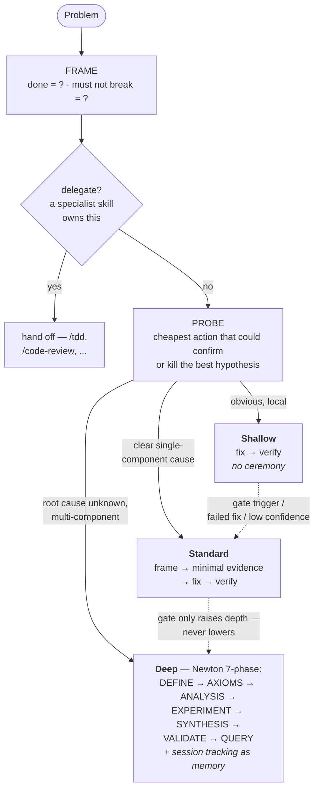

<div align="center">

# inquisitor

**Hypothesis-driven problem solving for AI agents**
Probe · Falsify · Escalate — never overcomplicate, never blind-retry

[](https://python.org)
[](https://modelcontextprotocol.io)
[](https://github.com/astral-sh/uv)
[](https://github.com/1111111111111111111114oLvT2/inquisitor/actions/workflows/ci.yml)
[]()

</div>

<!-- mcp-name: io.github.1111111111111111111114oLvT2/inquisitor -->

## Overview

**inquisitor** makes AI agents solve problems the way a chess engine plays chess: it cannot explore every branch, so it **estimates complexity first, prunes paths that add no information, and spends its search budget only where the problem actually is**.

It ships as two coordinated layers:

- **MCP server** (`inquisitor-mcp`) — the engine. Web search, project analysis, code tracing, project scaffolding, and a persistent investigation state machine. Works with any MCP-compatible agent: OpenCode, Claude Code, Claude Desktop, Cursor.
- **Agent skill** (`skills/inquisitor/SKILL.md`) — the behavioral layer. Injects the probe-and-gate loop, the pruning rules, and the full methodology into the agent's reasoning.

The method is not invented here — it is assembled from primary sources: Newton's Analysis→Synthesis skeleton, hardened with the scientific method's own defenses against wrong assumptions (falsification, strong inference, competing-hypotheses analysis, anti-fixation reframes, pre-mortems) and constrained by engineering discipline (NASA/JPL's Power of Ten, surgical-change guidelines, the minimalism ladder). Every source is cited in [Foundations](#foundations).

> Web search, codebase scans, and code tracing are **tools invoked when local evidence is insufficient — never mandatory rituals**.

---

## How it decides

Depth is an **output, not a label**. An LLM's up-front difficulty guess is its least reliable signal — poorly calibrated, and biased to under-rate exactly the hard problems that matter. So inquisitor never classifies a problem before understanding it: it runs a cheap **probe** (the single cheapest action that could confirm or kill the best current hypothesis), and the probe's *result* — never the prediction — sets the depth:



**Escalation is enforced, not just allowed.** The probe is only a starting point: objective gate triggers (touching infra/deploy/routing/config, auth/security, data migrations, multi-file fixes, prod-only symptoms) force a minimum depth regardless of how "clear" the problem feels, and a 3-question confidence check (read the runtime path? can name the runtime signal? verified the platform assumption?) bumps the depth up per unanswered question. Downgrades need cited evidence, never a feeling. **Inflated ceremony is not allowed either** — a 7-phase investigation of a typo is as wrong as a blind guess at a race condition.

**Retry is never blind.** "Loop until it passes" agents (the Ralph-loop pattern) have persistence but no memory: on failure they revert, flush, and re-roll — the same wrong idea, retried with fresh confidence. Inquisitor keeps a failure ledger instead: every dead hypothesis is recorded with the evidence that killed it, every retry must name what is different and why that changes the outcome, and two dead hypotheses from the same family force a *reframe* — re-audit an assumption, invert the question, widen the system boundary — never a third attempt at the same idea. Persistence with memory, creativity on evidence.

---

## Foundations

Each rule in the method traces to a primary source. The left column is the citation; the right column is the exact mechanism inquisitor takes from it.

### The scientific method

| Source | Mechanism adopted |
|--------|-------------------|
| Isaac Newton, [*Opticks*, Query 31](https://www.gutenberg.org/ebooks/33504) (1704) | The investigation skeleton: Analysis before Synthesis — define, decompose, experiment, only then reconstruct — and closing with open Queries instead of false certainty. *Hypotheses non fingo.* |
| T.C. Chamberlin, [*The Method of Multiple Working Hypotheses*](https://www.science.org/doi/10.1126/science.148.3671.754), Science (1890) | Hold at least two rival explanations at all times; a single hypothesis turns every subsequent observation into confirmation. |
| Abraham Luchins, *Mechanization in Problem Solving* (1942) — the [Einstellung effect](https://en.wikipedia.org/wiki/Einstellung_effect) | The failure ledger's trigger: repeating a familiar approach after it stopped working is a measurable fixation, and the cure is a forced reframe, not another attempt. |
| Karl Popper, [*The Logic of Scientific Discovery*](https://en.wikipedia.org/wiki/The_Logic_of_Scientific_Discovery) (1959) | Falsify first: for the leading hypothesis, name the observation that would disprove it and hunt for that observation before anything else. |
| John Platt, [*Strong Inference*](https://www.science.org/doi/10.1126/science.146.3642.347), Science (1964) | Design the experiment that *excludes* a hypothesis, not the one that corroborates the favorite — discriminating tests over confirming tests. |
| Richards J. Heuer, [*Psychology of Intelligence Analysis*](https://www.cia.gov/resources/csi/books-monographs/psychology-of-intelligence-analysis-2/), CIA (1999) | Analysis of Competing Hypotheses: rank hypotheses by the evidence *inconsistent* with each — confirming evidence is cheap and usually fits several at once. |
| Gary Klein, [*Performing a Project Premortem*](https://hbr.org/2007/09/performing-a-project-premortem), Harvard Business Review (2007) | Before shipping: assume the fix is live and the problem still happens — name the likeliest reason and probe it now. |

### Engineering discipline

| Source | Mechanism adopted |
|--------|-------------------|
| Gerard J. Holzmann (NASA/JPL), [*The Power of Ten: Rules for Developing Safety-Critical Code*](https://spinroot.com/gerard/pdf/P10.pdf) (2006) | The P10 template: a rule set small enough to remember and strict enough to check mechanically. |
| [Andrej Karpathy's LLM coding guidelines](https://github.com/forrestchang/andrej-karpathy-skills) (2025) | Think before coding · simplicity first · surgical changes · goal-driven execution. |
| [Ponytail decision ladder](https://github.com/dietrichgebert/ponytail) | YAGNI → reuse → stdlib → native platform → installed dependency → one line → minimum code that works. |

---

## Installation

Requires [uv](https://github.com/astral-sh/uv) and Python 3.12+.

### Claude Code — plugin install (recommended)

inquisitor ships as a [Claude Code plugin](https://code.claude.com/docs/en/plugins) that installs **both the skill and the MCP server** — no cloning, no editing absolute paths, no manual symlink.

From within Claude Code, first add the marketplace:

```
/plugin marketplace add 1111111111111111111114oLvT2/inquisitor
```

Then install the plugin:

```
/plugin install inquisitor@inquisitor
```

That's it. The plugin bundles the `inquisitor-mcp` server (registered automatically via `${CLAUDE_PLUGIN_ROOT}`) and the `inquisitor` skill. `uv` syncs the server's dependencies on first launch. Update later with `/plugin marketplace update inquisitor`.

> Prefer to point at a local checkout instead of GitHub? `/plugin marketplace add /path/to/inquisitor` works too.

For **OpenCode** and **Claude Desktop** (which don't use Claude Code plugins), or for a manual Claude Code setup, use the steps below.

### Step 1 — Get the server

**Option A — no clone (recommended).** Once published to PyPI, `uvx` fetches and runs it on demand — no clone, no absolute paths:

```bash
uvx inquisitor-mcp   # prints a ready message and waits for a client — Ctrl+C to exit
```

You'll reference `uvx inquisitor-mcp` directly in the config below.

**Option B — from a checkout** (for local development, or before the PyPI release):

```bash
git clone https://github.com/1111111111111111111114oLvT2/inquisitor.git ~/tools/inquisitor
cd ~/tools/inquisitor
uv sync
```

> The clone path is up to you — just use the **same absolute path** in the config below. `~` does not expand inside JSON config files, so write the full path (e.g. `/home/you/tools/inquisitor`).

You do **not** run the server manually. It's a stdio MCP server: your agent spawns and manages it automatically. (If you run it by hand it prints a ready message on stderr and waits silently — that's normal.)

### Step 2 — Register the MCP server with your agent

**OpenCode** — add to `~/.config/opencode/opencode.json` (global) or `./opencode.json` (per-project):

```json
{
  "$schema": "https://opencode.ai/config.json",
  "mcp": {
    "inquisitor": {
      "type": "local",
      "command": ["uvx", "inquisitor-mcp"],
      "enabled": true
    }
  }
}
```

**Claude Code** — add to `.mcp.json` in your project, or `~/.claude.json` for all projects:

```json
{
  "mcpServers": {
    "inquisitor": {
      "command": "uvx",
      "args": ["inquisitor-mcp"]
    }
  }
}
```

**Claude Desktop** — same `mcpServers` block in `claude_desktop_config.json` (Settings → Developer → Edit Config).

> Using a checkout instead of `uvx`? Swap the command for `uv` with args `["run", "--directory", "/home/you/tools/inquisitor", "inquisitor-mcp"]`.

### Step 3 — Install the skill (the behavioral layer)

Symlink it so it stays up to date with the repo:

```bash
# OpenCode
mkdir -p ~/.config/opencode/skills
ln -s /home/you/tools/inquisitor/skills/inquisitor ~/.config/opencode/skills/inquisitor

# Claude Code
mkdir -p ~/.claude/skills
ln -s /home/you/tools/inquisitor/skills/inquisitor ~/.claude/skills/inquisitor
```

(Copying the folder works too — you'll just need to re-copy after updates.)

**Or, no clone** — install just the skill across agents with the [`skills`](https://github.com/vercel-labs/skills) CLI:

```bash
npx skills add 1111111111111111111114oLvT2/inquisitor
```

(This installs the skill only. For the `inquisitor_*` tools you still need the MCP server from Steps 1-2 — or use the Claude Code plugin above, which bundles both.)

### Step 4 — Restart your agent

Config is loaded at startup. Quit and reopen OpenCode / Claude Code, then verify:
the `inquisitor_*` tools appear in the tool list, and the `inquisitor` skill is available.

---

## Tools

| Tool | Purpose | When |
|------|---------|------|
| `inquisitor_search` | Multi-backend web search (DuckDuckGo free/keyless, Brave, SearXNG) with content extraction (HTML + PDF) | Local evidence insufficient: unknown errors, unfamiliar libraries, current best practices |
| `inquisitor_analyze` | Project overview: languages, frameworks, tests, deps, git history | Entering an unfamiliar codebase |
| `inquisitor_trace` | Symbol tracing: definition, callers, callees with `file:line` refs | Bug spans multiple functions/files |
| `inquisitor_phase_get` / `_set` | Newton 7-phase state machine, SQLite-backed per project; forward moves advance one phase at a time, backward loops always allowed | Deep investigations — persistent memory across turns |
| `inquisitor_verify` | Completeness check: every phase recorded? evidence cited? (semantic validation — contradictions, DEFINE satisfaction — stays with the agent) | Before declaring a Deep investigation done |
| `inquisitor_scaffold` | Minimal project scaffolding with researched best practices | New project setup, after requirements are clarified |

### Example: `inquisitor_search`

```python
inquisitor_search(
    query="httpx ConnectTimeout retry pattern",
    max_results=8,
    time_range="year",              # day | week | month | year
    include_domains=["github.com"], # optional site: filter
    fetch_content=True,             # full page text, not just snippets
)
```

### Example: phase tracking (Deep path)

```python
inquisitor_phase_set(
    target_phase="experiment",
    findings="500 only occurs when session token > 4KB",
    evidence="repro script output; nginx.conf:34 large_client_header_buffers",
    open_questions="why did token size grow after v2.3 deploy?",
)
```

---

## Project Structure

```
inquisitor/
├── src/inquisitor/
│   ├── server.py                # MCP entry point (FastMCP, 6 tools)
│   ├── config.py                # env configuration
│   ├── tools/                   # thin MCP adapters
│   │   └── search / analyze / trace / scaffold / phase / verify
│   └── backend/                 # pure Python, zero MCP dependency
│       ├── search.py            # DDG / Brave / SearXNG + re-ranking
│       ├── extract.py           # trafilatura → readability fallback, SSRF guard
│       ├── analyzer.py          # project structure scan
│       ├── tracer.py            # callers / callees mapping
│       └── phase_tracker.py     # Newton state machine (SQLite)
├── skills/inquisitor/SKILL.md   # behavioral layer for the agent
├── .claude-plugin/
│   ├── plugin.json              # Claude Code plugin manifest
│   └── marketplace.json         # self-hosted marketplace (source ".")
├── .mcp.json                    # bundled MCP server (${CLAUDE_PLUGIN_ROOT})
└── tests/                       # 36 tests
```

The `backend/` package is importable standalone — no MCP required:

```python
from inquisitor.backend.search import search
results = search("python asyncio best practices", max_results=5)
```

---

## Environment Variables

| Variable | Required | Default | Description |
|----------|----------|---------|-------------|
| `INQUISITOR_SESSION_DIR` | no | `~/.inquisitor/sessions/` | Investigation state storage |
| `BRAVE_API_KEY` | no | — | Brave Search backend (2k free/month) |
| `SEARXNG_URL` | no | — | Self-hosted SearXNG instance |
| `INQUISITOR_DEFAULT_ENGINE` | no | `ddg` | `ddg` \| `brave` \| `searxng` |
| `INQUISITOR_SEARCH_TIMEOUT` | no | `15` | HTTP timeout (seconds) |
| `INQUISITOR_MAX_CONTENT_LENGTH` | no | `40000` | Max chars per fetched page |
| `INQUISITOR_PREFERRED_DOMAINS` | no | — | Comma-separated domains to boost in ranking |
| `INQUISITOR_PDF_BACKEND` | no | `auto` | PDF extraction: `auto` \| `docling` \| `pypdf` |

No API key is required — DuckDuckGo works out of the box.

### PDF extraction

Search results and fetched URLs that are PDFs (RFCs, specs, papers, datasheets) are extracted, not skipped. The default policy is `auto`, which uses **pypdf** (pure-Python, fast, no models, handles text PDFs) unless docling is installed and a GPU is present.
For complex tables or scanned/OCR PDFs, install the optional **docling** backend:

```bash
uv pip install "inquisitor-mcp[docling]"   # or: pip install "inquisitor-mcp[docling]"
```

docling is heavy (pulls in `torch` + ML models) and slow on CPU, so `auto` only uses it when it's installed **and** a GPU is present; otherwise it falls back to pypdf. Force it with `INQUISITOR_PDF_BACKEND=docling` (works on CPU, just slower), or pin pypdf with `INQUISITOR_PDF_BACKEND=pypdf`. Any docling failure falls back to pypdf, so a PDF read never hard-fails.

---

## Security

- **SSRF guard**: content fetching refuses non-http(s) schemes and loopback / private / link-local / metadata targets (`localhost`, `127.0.0.1`, `10.x`, `192.168.x`, `169.254.169.254`, …).
- **Path traversal guard**: session names are sanitized before touching the filesystem.
- **No shell execution**: subprocess calls use argument lists, never `shell=True`.
- **Parameterized SQL** throughout the session store.
- The server runs locally over stdio with your user's privileges — it does not listen on the network.

---

## Companion skills

inquisitor is a router as much as an investigator — it delegates to purpose-built skills (`/tdd`, `/code-review`, …) when one fits, but it never installs them for you. See **[docs/companion-skills.md](docs/companion-skills.md)** for the curated set worth installing alongside it (mattpocock/skills, spec-kit, last30days, ponytail, gstack) and design references.

---

## Development

```bash
uv sync                  # install deps
uv run pytest tests/ -v  # run tests
uv run ruff check .      # lint
```

## Tech

- **uv** — package manager
- **FastMCP** — MCP server framework
- **ddgs / httpx** — search + HTTP
- **trafilatura + readability-lxml** — content extraction (two-tier fallback)
- **SQLite** — investigation state
- **pytest / ruff** — tests and lint

---

## Acknowledgments

Research sources are cited in [Foundations](#foundations). The implementation additionally builds on:

- **[andrej-karpathy-skills](https://github.com/forrestchang/andrej-karpathy-skills)** (forrestchang) — behavioral guidelines derived from [Andrej Karpathy's observations](https://x.com/karpathy/status/2015883857489522876) on LLM coding pitfalls.
- **[ponytail](https://github.com/dietrichgebert/ponytail)** (Dietrich Gebert) — the decision ladder and the lazy-senior-dev discipline.
- **[last30days-skill](https://github.com/mvanhorn/last30days-skill)** (mvanhorn) — inspiration for multi-source research design and the SKILL.md-as-contract pattern.

Licensed under [MIT](LICENSE).
